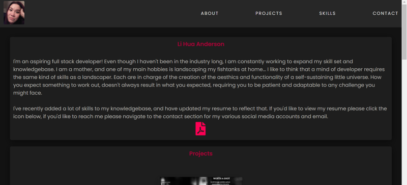

# portfolio2
[Link to live App](https://chopsushi206.github.io/portfolio2/)

## Requirements

* Submit an updated portfolio featuring Project 1 and two exemplary homework assignments.

* Submit an updated GitHub profile with pinned repositories featuring Project 1 and two exemplary assignments.

* Submit an updated resume

* Submit an updated LinkedIn profile

## Development

Added new projects to that section and edited the layout and colorscheme a bit. Also tried to add some effects to the project cards, but removed them due to functionality in mobile browsers. Added a few more animations, along with icons, and a link to my resume. LinkedIn page was updated as well to reflect new skills.

## Screenshots

---

## Developer

 Coding and repository done by [Li Hua Anderson](https://github.com/chopsushi206).

[Email](mailto:lihua.anderson@gmail.com) | [LinkedIn](https://linkedin.com/in/li-hua-anderson-b259b7144)
